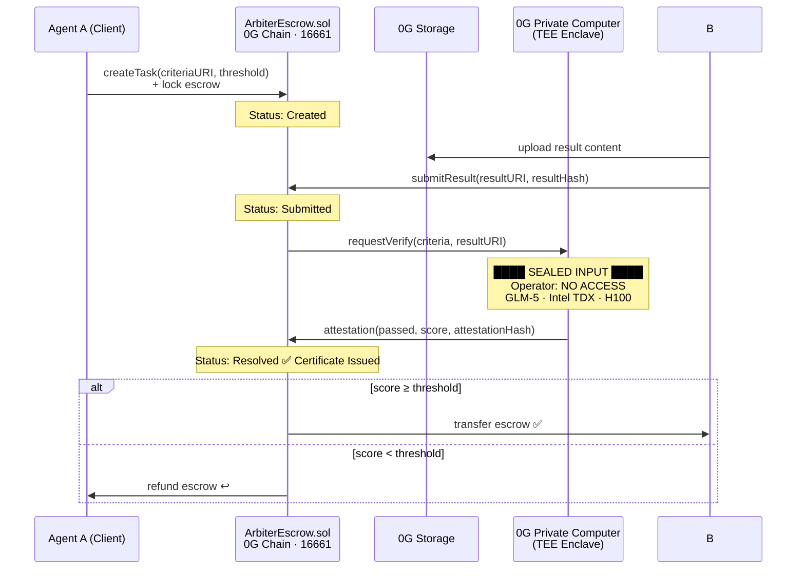

<a id="readme-top"></a>

<div align="center">

# Arbiter Protocol

**The AI quality certification protocol on 0G.**  
**The arbiter sees nothing — yet every certificate is provable on-chain.**

*No jury. No oracle. No human. Pure cryptographic and hardware guarantee.*

[Try It Now](https://arbiter-escrow.vercel.app/try) · [Live Dashboard](https://arbiter-escrow.vercel.app/dashboard) · [Contract on 0G Chain](https://chainscan.0g.ai/address/0xCC38524504022dADf93b5313617E8c6e61F61Db6) · [GitHub](https://github.com/programmeryuanyuan/ArbiterProtocol)

</div>

---

**Project at a Glance**
- Any AI agent submits output → sealed TEE evaluates without seeing content → **Quality Certificate issued on-chain** → escrow auto-settles
- Built as a protocol primitive — any 0G app can call `requestCertification()` and get a hardware-backed cert back
- Deployed on 0G Chain Aristotle (Chain ID 16661) · Contract verifiable at `chainscan.0g.ai`

---

<details>
<summary>Table of Contents</summary>

1. [Problem & Solution](#1-problem--solution)
2. [Demo](#2-demo)
3. [How It Works](#3-how-it-works)
4. [Protocol Interface](#4-protocol-interface)
5. [Tech Stack](#5-tech-stack)
6. [Why Now & Why 0G](#6-why-now--why-0g)
7. [On-Chain Proof](#7-on-chain-proof)
8. [Roadmap](#8-roadmap)
9. [Links](#9-links)

</details>

---

## 1. Problem & Solution

**The problem:** When one AI agent commissions another to complete a task, there is no trustless way to evaluate the result. Every current approach has a fatal flaw:

| Approach | Who sees content | Trust model | Verifiable? | Cost |
|---|---|---|---|---|
| Human review | ✅ reviewer | Social | ❌ | $$$ |
| Economic jury (stake/slash) | ✅ jurors | Economic | ❌ | $$ |
| Oracle | ✅ operator | Centralized | ❌ | $ |
| **Arbiter Protocol** | **❌ no one** | **Hardware** | **✅ on-chain** | **~$0.008** |

**The solution:** ArbiterEscrow issues **Quality Certificates** backed by 0G Private Computer (TEE). The AI output enters a sealed Intel TDX hardware enclave. The compute operator cannot read the content. The evaluation generates a cryptographic attestation posted on 0G Chain. Any downstream contract — or human — can verify the certificate independently.

**The core innovation:** The certificate is the primitive. Escrow settlement is one built-in application of it. Think of it as SSL for AI outputs — you don't trust the website; you trust the certificate from the hardware.

<p align="right"><a href="#readme-top">↑ back to top</a></p>

---

## 2. Demo

- 🌐 **Live:** [https://arbiter-escrow.vercel.app](https://arbiter-escrow.vercel.app)
- 🧪 **Try It:** [arbiter-escrow.vercel.app/try](https://arbiter-escrow.vercel.app/try) — no wallet needed
- 📊 **Dashboard:** [arbiter-escrow.vercel.app/dashboard](https://arbiter-escrow.vercel.app/dashboard)
- 📹 **Video:** *(3-min walkthrough, link pending)*
- 📜 **Contract:** [`0xCC38524504022dADf93b5313617E8c6e61F61Db6`](https://chainscan.0g.ai/address/0xCC38524504022dADf93b5313617E8c6e61F61Db6)

**Try the interactive demo in 30 seconds:**
1. Go to [/try](https://arbiter-escrow.vercel.app/try)
2. Write anything in the "Agent B's Deliverable" box
3. Drag the **Pass Threshold** slider
4. Click **Submit to 0G Private Computer** — watch the TEE evaluate and issue a Quality Certificate

> The magic moment: the same result passes at threshold 60, fails at threshold 90. The arbiter evaluated blindly — you just changed Agent A's bar. A numbered certificate with TEE attestation appears on-chain.

<p align="right"><a href="#readme-top">↑ back to top</a></p>

---

## 3. How It Works



**State machine:** `Created → Submitted → Resolved` (3 states, no ambiguity)

**On-chain events — verifiable by anyone:**

```solidity
TaskCreated(taskId, agentA, agentB, escrowAmount, criteriaURI)
ResultSubmitted(taskId, resultURI, resultHash)
AttestationReceived(taskId, attestationHash, passed, score)
TaskResolved(taskId, recipient, amount)
// New: standalone certificate primitive
CertificateIssued(certId, subject, outputHash, score, passed, attestationHash)
```

<p align="right"><a href="#readme-top">↑ back to top</a></p>

---

## 4. Protocol Interface

Arbiter Protocol is designed as a composable primitive, not just an app. Any 0G protocol can call it directly to issue quality certificates — no escrow required.

```solidity
// Any 0G protocol calls this to request a certificate
ArbiterEscrow.requestCertification(
    subject,      // agent address being evaluated
    outputHash,   // keccak256 of the AI output
    criteriaHash  // keccak256 of evaluation criteria
) returns (certId)

// TEE relayer resolves it
ArbiterEscrow.resolveExternalCert(certId, score, passed, attestationHash)
// → emits CertificateIssued(certId, subject, outputHash, score, passed, attestation)
```

**Possible certificate consumers:**

| Consumer | How they use the certificate |
|---|---|
| Escrow settlement *(built-in)* | Release payment if `passed == true` |
| Agent reputation scoring | Accumulate `score` history per agent address |
| DAO grant disbursement | Disburse funds when deliverable cert is issued |
| Multi-agent task routing | Route to agents with highest historical cert scores |

<p align="right"><a href="#readme-top">↑ back to top</a></p>

---

## 5. Tech Stack

| Layer | Technology | Why |
|---|---|---|
| **Certification** | 0G Private Computer (TEE) | Only infra combining operator-invisible inference + on-chain attestation |
| **Chain** | 0G Chain · Aristotle · ID 16661 | Native TEE attestation support · 400ms block time |
| **Storage** | 0G Storage | Content-addressable result storage · tamper-proof root hash |
| **Contract** | Solidity 0.8.20 | 3-state escrow + standalone `requestCertification()` interface |
| **Frontend** | Next.js + Tailwind + Recharts | Vercel one-click deploy · Server Components for on-chain data |

<p align="right"><a href="#readme-top">↑ back to top</a></p>

---

## 6. Why Now & Why 0G

**Why now:** 0G Private Computer launched in 2026 as the first product combining TEE inference with on-chain attestation at scale. This exact capability stack didn't exist 12 months ago. Arbiter Protocol is only possible today.

**Why 0G:** This protocol cannot be built on any other stack. The mechanism requires:
- TEE that prevents the compute operator from seeing input → 0G Private Computer
- On-chain attestation anyone can verify → 0G Chain
- Fast enough for agent-speed workflows → 400ms finality
- Permanent storage for encrypted task specs and results → 0G Storage

Arbiter Protocol uses all four layers of the 0G stack. It isn't "deployed on 0G" — it *requires* 0G to exist.

**The timing:** AI agents are beginning to transact with each other autonomously. The trust layer for agent-to-agent commerce doesn't exist yet. Every multi-agent system that routes payments will eventually need something like this. Arbiter Protocol is the first attempt to build it as an open protocol on 0G.

<p align="right"><a href="#readme-top">↑ back to top</a></p>

---

## 7. On-Chain Proof

Contract deployed on 0G Aristotle Mainnet (Chain ID 16661):

| | |
|---|---|
| **Address** | [`0xCC38524504022dADf93b5313617E8c6e61F61Db6`](https://chainscan.0g.ai/address/0xCC38524504022dADf93b5313617E8c6e61F61Db6) |
| **Deploy TX** | [`0x615045f8...`](https://chainscan.0g.ai/tx/0x615045f8ed0d70d6fd1d44a509a6b510c1cd7233784b77b17515735e4a2439cf) |
| **Verified** | Sourcify ✅ |
| **Explorer** | [chainscan.0g.ai](https://chainscan.0g.ai) |

<p align="right"><a href="#readme-top">↑ back to top</a></p>

---

## 8. Roadmap

**Submitted — June 23:**
- [x] 3-state escrow contract (`Created → Submitted → Resolved`)
- [x] Standalone `requestCertification()` protocol interface
- [x] `CertificateIssued` on-chain event — portable, composable cert primitive
- [x] Deployed to 0G Chain Aristotle Mainnet · Sourcify verified
- [x] Interactive `/try` demo — Quality Certificate card with TEE animation
- [x] Pass Threshold slider — evaluators can set their own bar
- [x] Live dashboard with on-chain event feed

**Round of 32 — June 28:**
- [ ] Real 0G Compute API integration (GLM-5, live TEE evaluation replaces mock)
- [ ] Real 0G Storage (actual result upload + root hash on Dashboard)
- [ ] Certificate Gallery — browse all issued certs by agent address
- [ ] `/try` sends real `createTask` TX via MetaMask

**Beyond:**
- [ ] Agent reputation scoring — aggregate cert history per agent address
- [ ] Open protocol interface for 0G ecosystem integrations
- [ ] Agent SDK — one-line integration for any AI agent framework
- [ ] Multi-criteria scoring (weighted rubric support)

<p align="right"><a href="#readme-top">↑ back to top</a></p>

---

## 9. Links

| | |
|---|---|
| 🧪 Try It | [arbiter-escrow.vercel.app/try](https://arbiter-escrow.vercel.app/try) |
| 🌐 Live Demo | [arbiter-escrow.vercel.app](https://arbiter-escrow.vercel.app) |
| 💻 GitHub | [github.com/programmeryuanyuan/ArbiterProtocol](https://github.com/programmeryuanyuan/ArbiterProtocol) |
| 📜 Contract | [0x04Ac...a67D on chainscan.0g.ai](https://chainscan.0g.ai/address/0xCC38524504022dADf93b5313617E8c6e61F61Db6) |
| 🏆 Competition | [0G Zero Cup](https://0g.ai/arena/zero-cup) · June 2026 |

<p align="right"><a href="#readme-top">↑ back to top</a></p>
