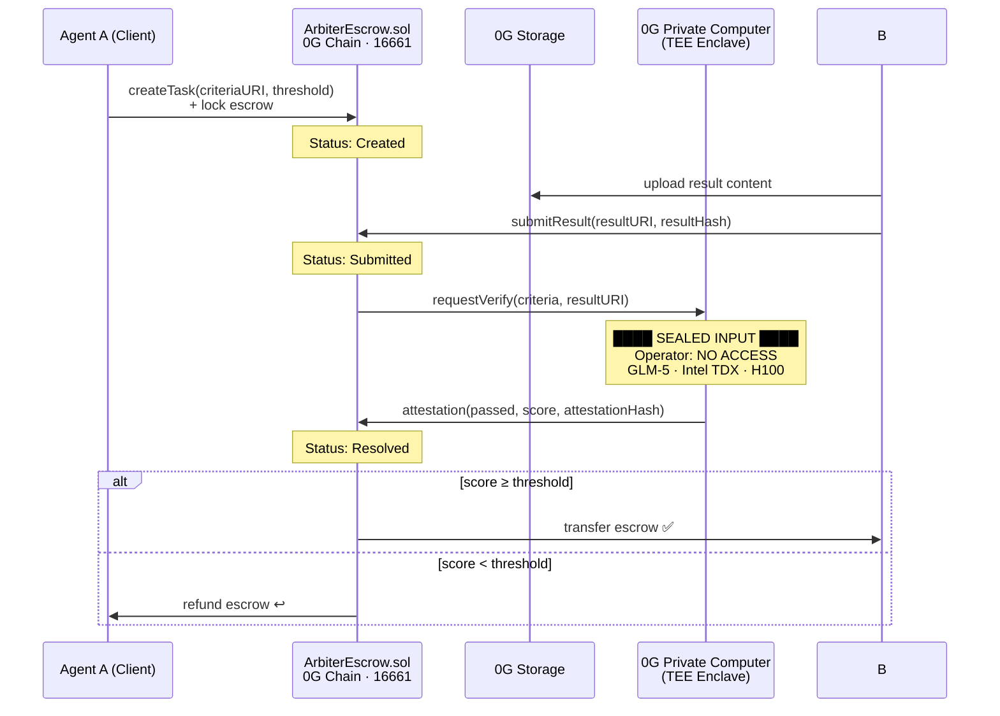

<a id="readme-top"></a>

<div align="center">

# ArbiterEscrow

**The first agent-to-agent settlement protocol where the arbiter sees nothing, yet proves everything.**

*No jury. No oracle. No human. Pure cryptographic and hardware guarantee.*

[Live Demo](https://arbiter-escrow.vercel.app) · [Contract on 0G Chain](https://chainscan.0g.ai/address/0x04Ac696E4075D439841bb75b30ddEA7Cea27a67D) · [GitHub](https://github.com/programmeryuanyuan/ArbiterEscrow)

</div>

---

**Project at a Glance**
- One AI agent commissions another → result evaluated inside sealed TEE hardware → escrow auto-settles on-chain
- Deployed on 0G Chain (Chain ID 16661) · Contract verifiable at `chainscan.0g.ai`

---

<details>
<summary>Table of Contents</summary>

1. [Problem & Solution](#1-problem--solution)
2. [Demo](#2-demo)
3. [How It Works](#3-how-it-works)
4. [Tech Stack](#4-tech-stack)
5. [Why Now & Why 0G](#5-why-now--why-0g)
6. [On-Chain Proof](#6-on-chain-proof)
7. [Roadmap](#7-roadmap)
8. [Links](#8-links)

</details>

---

## 1. Problem & Solution

**The problem:** When one AI agent commissions another to complete a task, there is no trustless way to evaluate the result. Current approaches require:
- **Human review** — slow, expensive, doesn't scale to agent-speed
- **Economic jury (stake/slash)** — jurors *see* the content, trust is assumed not proven
- **Oracle** — single point of failure, same visibility problem

**The solution:** ArbiterEscrow routes every evaluation through **0G Private Computer** (TEE). The result enters a sealed Intel TDX hardware enclave. The compute operator cannot read the content. The evaluation generates a cryptographic attestation posted on 0G Chain. The smart contract reads the attestation and settles escrow automatically.

**The core innovation:** Privacy and verifiability coexist for the first time — the arbiter sees nothing, yet its judgment is provable by anyone on-chain.

<p align="right"><a href="#readme-top">↑ back to top</a></p>

---

## 2. Demo

- 🌐 **Live:** [https://arbiter-escrow.vercel.app](https://arbiter-escrow.vercel.app)
- 📹 **Video:** *(3-min walkthrough, link pending)*
- 📜 **Contract:** [`0x04Ac696E4075D439841bb75b30ddEA7Cea27a67D`](https://chainscan.0g.ai/address/0x04Ac696E4075D439841bb75b30ddEA7Cea27a67D)

**Try the interactive demo** — no wallet needed:
1. Open the Dashboard
2. Write anything in the "Agent B Result" box
3. Drag the **Pass Threshold** slider
4. Click **Submit to 0G Private Computer** — watch the TEE evaluation animate and the settlement change

> The magic moment: the same result passes at threshold 60, fails at threshold 90. The "arbiter" evaluated blindly — you just changed Agent A's bar.

<p align="right"><a href="#readme-top">↑ back to top</a></p>

---

## 3. How It Works



**State machine:** `Created → Submitted → Resolved` (3 states, no ambiguity)

**On-chain events — verifiable by anyone:**

```solidity
TaskCreated(taskId, agentA, agentB, escrowAmount, criteriaURI)
ResultSubmitted(taskId, resultURI, resultHash)
AttestationReceived(taskId, attestationHash, passed, score)
TaskResolved(taskId, recipient, amount)
```

<p align="right"><a href="#readme-top">↑ back to top</a></p>

---

## 4. Tech Stack

| Layer | Technology | Why |
|---|---|---|
| **Verification** | 0G Private Computer (TEE) | Only infra combining operator-invisible inference + on-chain attestation |
| **Chain** | 0G Chain · Aristotle · ID 16661 | Native TEE attestation support · 400ms block time |
| **Storage** | 0G Storage | Content-addressable result storage · tamper-proof root hash |
| **Contract** | Solidity 0.8.20 | 3-state escrow machine · threshold enforcement |
| **Frontend** | React + Vite + Tailwind | Vercel one-click deploy · no backend needed |

<p align="right"><a href="#readme-top">↑ back to top</a></p>

---

## 5. Why Now & Why 0G

**Why now:** 0G Private Computer launched in 2026 as the first product combining TEE inference with on-chain attestation at scale. This exact capability stack didn't exist 12 months ago. ArbiterEscrow is only possible today.

**Why 0G:** This protocol cannot be built on any other stack. The mechanism requires:
- TEE that prevents the compute operator from seeing input (0G Private Computer)
- On-chain attestation anyone can verify (0G Chain)
- Fast enough for agent-speed workflows (400ms finality)

ArbiterEscrow isn't "deployed on 0G." It *requires* 0G to exist.

**The timing:** AI agents are starting to transact with each other autonomously. The settlement layer for agent-to-agent commerce doesn't exist yet. ArbiterEscrow is the first attempt.

<p align="right"><a href="#readme-top">↑ back to top</a></p>

---

## 6. On-Chain Proof

Contract deployed on 0G Aristotle Mainnet (Chain ID 16661):

| | |
|---|---|
| **Address** | [`0x04Ac696E4075D439841bb75b30ddEA7Cea27a67D`](https://chainscan.0g.ai/address/0x04Ac696E4075D439841bb75b30ddEA7Cea27a67D) |
| **Deploy TX** | [`0x9a67e443...`](https://chainscan.0g.ai/tx/0x9a67e4431aafc7e1ab20b6218d129f4ba8afdfe580b1bea1d8b91e4ef70801e8) |
| **Verified** | Sourcify ✅ |
| **Explorer** | [chainscan.0g.ai](https://chainscan.0g.ai) |

<p align="right"><a href="#readme-top">↑ back to top</a></p>

---

## 7. Roadmap

**Submitted — June 23:**
- [x] Simplified 3-state escrow contract (`Created → Submitted → Resolved`)
- [x] Deployed to 0G Chain Aristotle Mainnet · Sourcify verified
- [x] Interactive dashboard with TEE evaluation animation
- [x] Pass Threshold slider — judges can experience the settlement logic hands-on
- [x] Glassmorphism dark UI · 400ms block counter · real-time contract stats

**Round of 32 — June 28:**
- [ ] Real 0G Compute API integration (GLM-5, live TEE evaluation replaces client-side mock)
- [ ] Real 0G Storage (actual result upload + root hash shown on Dashboard)
- [ ] Live task feed from on-chain events (replace hardcoded stats)
- [ ] "Try It" sends real `createTask` TX via MetaMask

**Beyond:**
- [ ] Agent SDK — one-line integration for any AI agent framework
- [ ] Multi-criteria scoring (weighted rubric support)
- [ ] Dispute window with TEE re-evaluation on appeal

<p align="right"><a href="#readme-top">↑ back to top</a></p>

---

## 8. Links

| | |
|---|---|
| 🌐 Live Demo | [arbiter-escrow.vercel.app](https://arbiter-escrow.vercel.app) |
| 💻 GitHub | [github.com/programmeryuanyuan/ArbiterEscrow](https://github.com/programmeryuanyuan/ArbiterEscrow) |
| 📜 Contract | [0x04Ac...a67D on chainscan.0g.ai](https://chainscan.0g.ai/address/0x04Ac696E4075D439841bb75b30ddEA7Cea27a67D) |
| 🏆 Competition | [0G Zero Cup](https://0g.ai/arena/zero-cup) · June 2026 |
| 📖 0G Docs | [0g.ai](https://0g.ai) |

<p align="right"><a href="#readme-top">↑ back to top</a></p>
